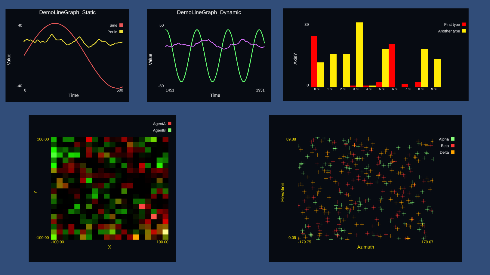

# SciGraph

SciGraph is a library for Unity to create realtime graphs, mainly for scientific visualization.

## Features

* Line graph
* Histogram
* Scatter plot
* Heatmap
* All can be dynamic or static
* All can have subgraphs to display information from multiple sources
* No prefabs necessary, code builds all the UI based on the size of the container and the parameters of the given graph

## Installation

Just drag this into your Unity project, or add it as a submodule if you're using git.

These graphs make use of [NaughtyAttributes] and [UnityUIExtensions], and are required to compile.

## Use

You can add any of the three primary Monobehaviours (LineGraph, HistGraph, ScatterGraph or Heatmap) to any object.
Loading data into them is done through the C# API.

## Credits

* Code by Diogo de Andrade
* [NaughtyAttributes] by Denis Rizov (not a fork because I want to be able to use this easily as a submodule)
* [UnityUIExtensions] available through the [BSD3] license.

## Licenses

All code by me in this repo is made available through the [GPLv3] license.
NaughtyAtttributes is made available through the [MIT] license.
UnityUIExtensions is made available through the [BSD3] license.
The text and all the other files are made available through the 
[CC BY-NC-SA 4.0] license.

## Metadata

* Autor: [Diogo Andrade][]

[Diogo Andrade]:https://github.com/DiogoDeAndrade
[GPLv3]:https://www.gnu.org/licenses/gpl-3.0.en.html
[CC BY-NC-SA 4.0]:https://creativecommons.org/licenses/by-nc-sa/4.0/
[MIT]:https://opensource.org/licenses/MIT
[BSD3]:https://bitbucket.org/UnityUIExtensions/unity-ui-extensions/wiki/License
[Bfxr]:https://www.bfxr.net/
[NaughtyAttributes]:https://github.com/dbrizov/NaughtyAttributes
[UnityUIExtensions]:https://bitbucket.org/UnityUIExtensions/unity-ui-extensions/src/release/
